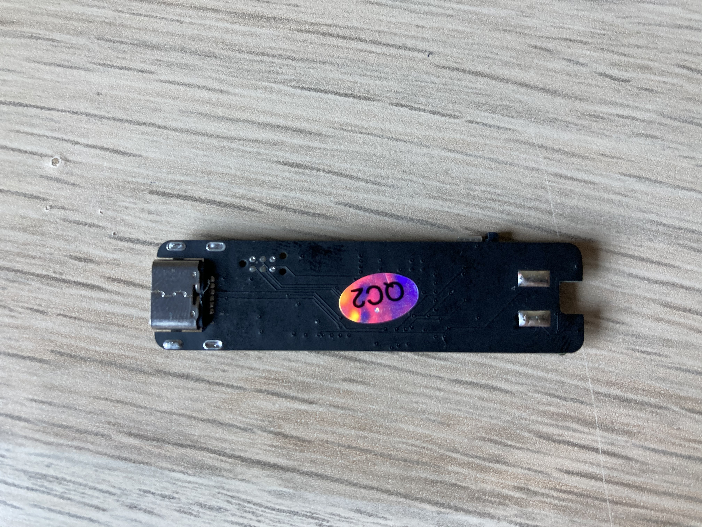
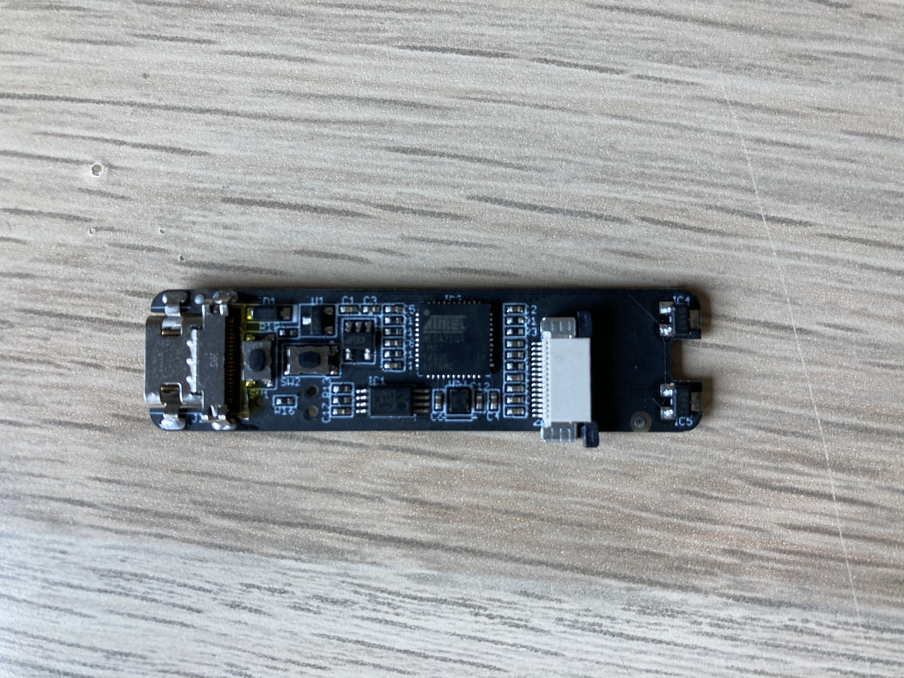
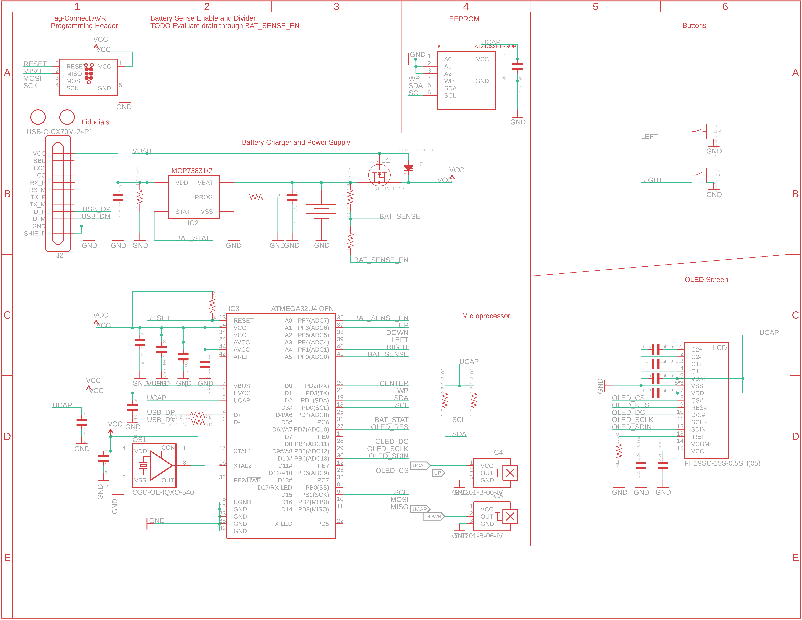
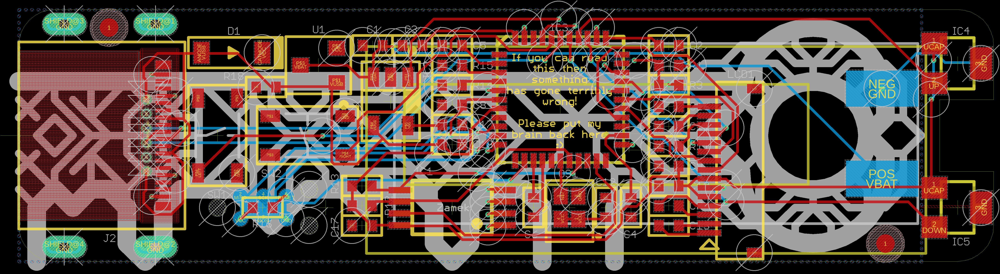

# Zamek
Your Digital Keychain.

I want to design the digital equivalent to the analog keychain. It keeps your passwords for you in an easy-to-use and portable, reliable design. It can be used completely standalone, but also with a Desktop App for easier data input.

Prototypes:

[Youtube Function Demo](https://www.youtube.com/watch?v=8wrW3907pkc)

Front View:

Back View:

This project is a Work-In-Progress; all contributions are welcome!

Project Layout:
* brd+sch contains hardware schematic
* desktop-app contains the desktop app
* zamek-src contains arduino source code
